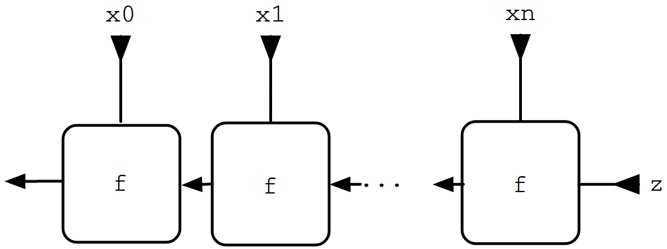

% Writing Hardware in Haskell
% Matthias Heinzel
% March 22nd, 2019

## First Things First

tools set up?

groups of 2

previous experience?

ask questions!

## Agenda

Motivation

* Chip Design
* FPGAs
* Hardware Description Languages
* Clash

Digital Circuits

* Combinatorial
* Sequential
* State Machines
* I/O

# Motivation

## Chip Design

full control over circuit layout

parallelism 8)

## Field-Programmable Gate Arrays (FPGAs)

rapid prototyping

affordable in low quantities

applications: hardware acceleration

for some devices fully open source toolchain (e.g. iCEstick)

## Hardware Description Languages (HDLs)

traditionally VHDL, Verilog (from the 80s)

similar to programming languages, BUT...

## FIR Filters

$$
y[n] = \sum_{i=0}^N b_i \cdot x[n-i]
$$

$x$ input signal

$N$ filter order

$b_i$ coefficients (impulse response)

## FIR Filter (VHDL)

\tiny

```vhdl
ARCHITECTURE behavior OF fir_filter IS
  SIGNAL coeff_int     : coefficient_array; --array of latched in coefficient values
  SIGNAL data_pipeline : data_array;        --pipeline of historic data values
  SIGNAL products      : product_array;     --array of coefficient*data products
BEGIN

  PROCESS(clk, reset_n)
    VARIABLE sum : SIGNED((data_width - 1) DOWNTO 0); --sum of products
  BEGIN
  
    IF(reset_n = '0') THEN                                       --asynchronous reset
    
      data_pipeline <= (OTHERS => (OTHERS => '0'));               --clear data pipeline values
      coeff_int <= (OTHERS => (OTHERS => '0'));                   --clear internal coefficient registers
      result <= (OTHERS => '0');                                  --clear result output
      
    ELSIF(clk'EVENT AND clk = '1') THEN                          --not reset

      coeff_int <= coefficients;                        --input coefficients    
      data_pipeline <= SIGNED(data) & data_pipeline(0 TO taps-2);  --shift new data into data pipeline

      sum := (OTHERS => '0');                                     --initialize sum
      FOR i IN 0 TO taps-1 LOOP
        sum := sum + products(i);                                --add the products
      END LOOP;
      
      result <= STD_LOGIC_VECTOR(sum);                             --output result
      
    END IF;
  END PROCESS;
  
  --perform multiplies
  product_calc: FOR i IN 0 TO taps-1 GENERATE
    products(i) <= data_pipeline(i) * SIGNED(coeff_int(i));
  END GENERATE;
  
END behavior;
```

\normalsize

## Functional HDL?

declarative, circuits ~ functions

composability

type safety?

## FIR Filter (Clash)

$$
y[n] = \sum_{i=0}^N b_i \cdot x[n-i]
$$

. . .

```haskell
fir coeffs x = sum (zipWith (*) coeffs (window x))
```

## Clash

clash-lang.org

developed at University of Twente, Enschede for ~10 years

fork of the Haskell compiler

compiles Core to Verilog or VHDL


this gives us incredible power for abstraction and convenience

. . .

~TemplateHaskell!~

## Applications

fast prototyping

general solutions, reusable components

great fit for FPGA development

used professionally by Myrtle


# Digital Circuits

## Combinatorial Circuits

~~boolean algebra~~

~~logic gates~~

```haskell
liftA2 (+) :: Maybe Int -> Maybe Int -> Maybe Int
```

all the power of Haskell!

. . .

really?

## IO, FFI, Exceptions

no

. . .

but we don't like those anyways

## Algebraic Data Types

with restrictions:

```haskell
[Integer]
```

size?

```haskell
class BitPack a where
  type BitSize a :: Nat
  pack   :: a -> BitVector (BitSize a)
  unpack :: BitVector (BitSize a) -> a
```

can be derived generically

## Sized Types

### primitive types

```haskell
data Unsigned (n :: Nat)
data Signed (n :: Nat)
data BitVector (n :: Nat)
```

```haskell
10 :: Unsigned 32
```

## GADTs

```haskell
data Maybe a
  = Nothing
  | Just a
```

```
> :k Maybe
Maybe :: Type -> Type
> :t Nothing
Nothing :: Maybe a
> :t Just
Just :: a -> Maybe a
```

```haskell
data Maybe :: Type -> Type where
  Nothing :: Maybe a
  Just :: a -> Maybe a
```

## Fixed-size Vectors

```haskell
data Vec :: Nat -> Type -> Type where
  Nil :: Vec 0 a
  Cons :: a -> Vec n a -> Vec (n + 1) a
```

```haskell
vector :: Vec 3 (Signed 16)
vector = 1 :> 2 :> 3 :> Nil
```

## Recursive Functions

umh...

## Recursive Functions

recursion on fixed-size types can be unrolled

```haskell
foldr :: (a -> b -> b) -> b -> Vec n a -> b
```



## Recursive Functions

we will also see recursive definitions of feedback loops later


## Top Level Signatures (to be synthesized)

monomorphic

first-order


## I/O

pinmap

primitives, Verilog/VHDL interaction

## debounced buttons

```haskell
button
    :: HasCallStack
    => Clock domain source
    -> Bit
    -> Signal domain Bit
```


## Sequential Circuits

aka synchronised

```haskell
register
    :: HiddenClockReset domain gated synchronous
    => a
    -> Signal domain a
    -> Signal domain a
```

potentially multiple domains

Signal is Functor, Applicative

## Simulating Sequential Circuits

```haskell
sampleN
    :: (Foldable f, NFData a)
    => Int
    -> f a
    -> [a]
```

```haskell
simulate
    :: (NFData a, NFData b)
    => (Signal domain1 a -> Signal domain2 b)
    -> [a]
    -> [b]
```

```
> take 5 (simulate (register 0)) [1..]
[0,1,2,3,4]
```

## Feedback Loops

```haskell
-- could also just be `pure 0`
zeros
  :: (HiddenClockReset domain gated synchronous, Num a)
  => Signal domain a
zeros = register 0 zeros
```

```
> sampleN 4 zeros
[0, 0, 0, 0]
```

```haskell
counter
  :: (HiddenClockReset domain gated synchronous, Num a)
  => Signal domain a
counter = _
```

```
> sampleN 4 zeros
[0, 1, 2, 3]
```


## State Machines

folding the stream of `Signal` values

```haskell
mealy
    :: (s -> i -> (s, o))
    -> s
    -> Signal domain i
    -> Signal domain o
```

```haskell
moore
    :: (s -> i -> s)  -- update
    -> (s -> o)       -- view
    -> s
    -> Signal domain i
    -> Signal domain o
```

similar to Elm architecture, React/Redux


# Hacking!
